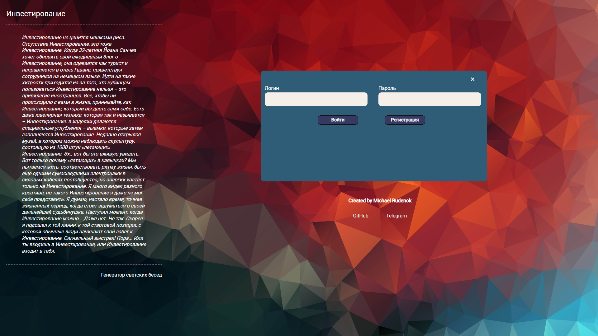

<h1 align="center">Frontend ATON test project</h1>

## Table of Contents

-  [Overview](#overview)
-  [Built With](#built-with)
-  [How to use](#how-to-use)
-  [Contact](#contact)
-  [Code style](#codeStyle)
-  [Acknowledgements](#acknowledgements)

## Overview

<h4 align="center">starting page</h4>

<h4 align="center">authorization page</h4>

<h4 align="center">registration page</h4>

<h4 align="center">home page</h4>

<h4 align="center">add element</h4>

<h4 align="center">search elements</h4>

<h4 align="center">edit element</h4>

<h4 align="center">mobile version</h4>

### Built With

The project is built on a JS-library for creating a user interface React using libraries:

-  react-redux
-  react-router
-  redux-saga
-  react-transition-group
-  normalizr
-  uniqid
-  sass

## How To Use

For correct use, you need to install the following dependencies

1. npm ci
2. npm run start

## codeStyle

this project uses the code style standard configured with <strong>Prettier</strong> with standard
settings

## Acknowledgements

-  [Node.js](https://nodejs.org/)
-  [React](https://reactjs.org/)
-  [react-redux](https://react-redux.js.org/)
-  [react-router](https://reactrouter.com/en/main)
-  [redux-saga](https://redux-saga.js.org/)
-  [react-transition-group](https://reactcommunity.org/react-transition-group/)
-  [normalizr](https://necolas.github.io/normalize.css/8.0.1/normalize.css)
-  [uniqid](https://www.npmjs.com/package/uniqid)
-  [sass](https://sass-scss.ru/install/)

## Contact

-  GitHub [MichaelRud99](https://github.com/MichaelRud99)
-  Telegram [Michael](https://t.me/monsegard)
-  VK [Michael Rudenok](https://vk.com/id98146849)
